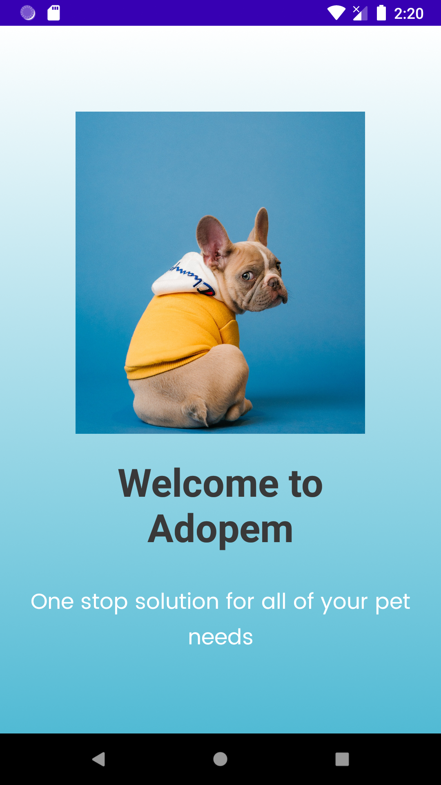
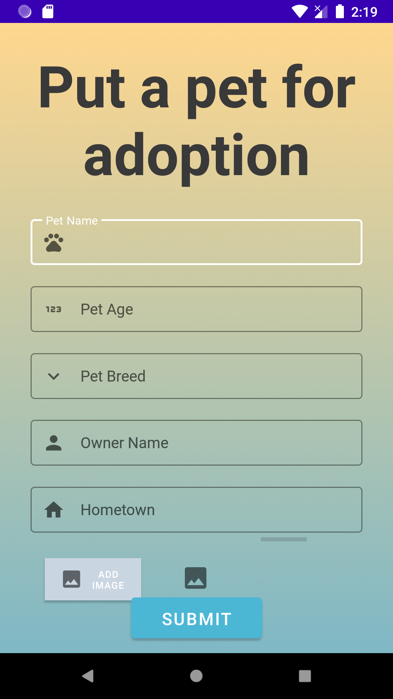
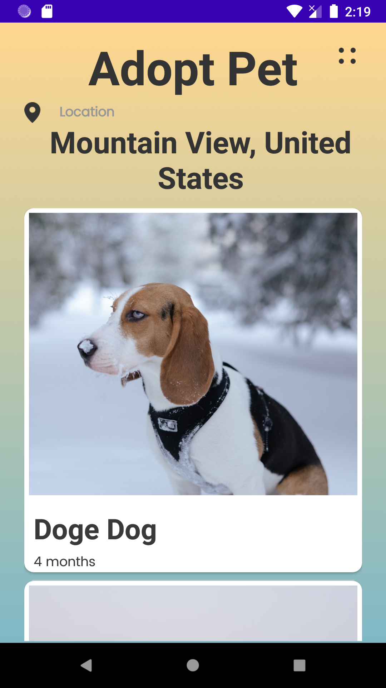
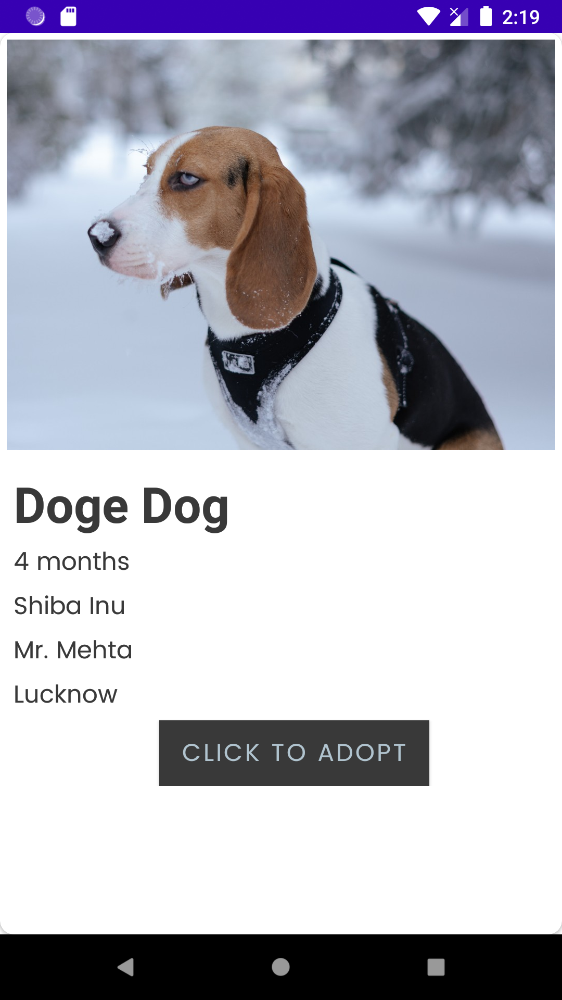
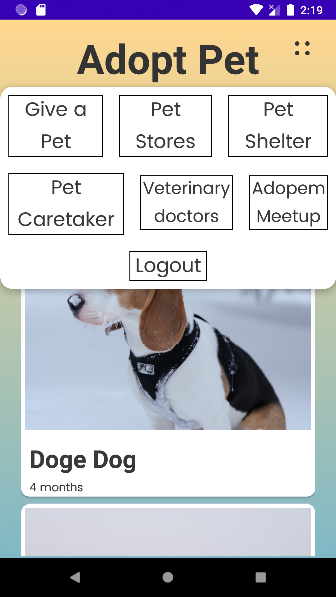

# Adopem
> ### A pet adoption mobile application

## About the app -
The main objective behind this mobile application is to connect the people who are willing to adopt a pet with the people who want to put up a pet for adoption. The app ensure that unwanted/street pets 
who deserve a good home can be found by the people who are willing to adopt. The 
digitalisation of this operation will help speed up the process of finding suitable homes for
innocent animals. 

## Features of the app - 
- Location
- Authentication 
- Adopt a pet
- Put a pet up for adoption
- Nearby pet shelter and stores
- Adopem Meetup :D
- Ask for a Pet caretaker

## Screenshots - 
 

